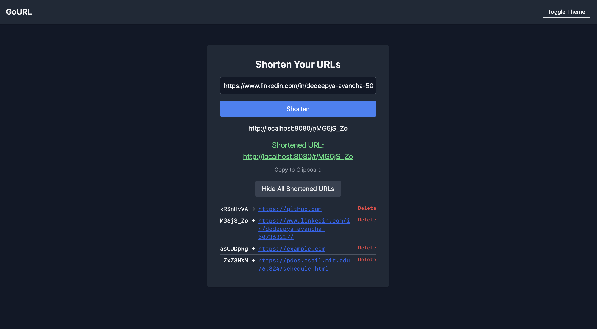
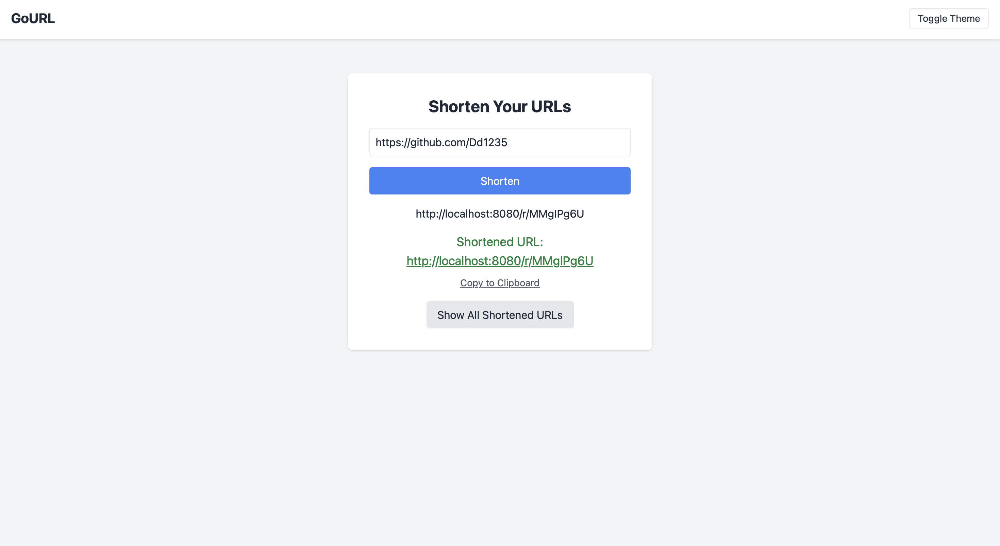

# GoURL

A simple URL shortening service built with Go, Redis, and htmx for a fast, single-page experience.

## Screenshots

<p align="center">
  <strong>Dark Mode</strong><br>
  
</p>
<p align="center">
  <strong>Light Mode</strong><br>
  
</p>

## Features

- **URL Shortening**: Generates unique, short codes for any valid URL.
- **Redirects**: Near-instantaneous redirection to the original URL, using Redis.
- **UI (htmx)**: A single-page application experience. Shorten URLs, view the entire list, and delete entries.
- **Interface (Tailwind CSS)**: Simple with both light and dark modes.
- **RESTful API**: For managing shortened URLs.
- **Containerized**: Configured to run with Docker for easy deployment and scalability.

## Setup and Running the Project

You can run the project locally or using Docker.

### 1. Running with Docker (Recommended)

This is the easiest way to get started.

**Prerequisites**: Docker and Docker Compose installed.

1.  **Start Redis Container**:

    ```bash
    docker run --name redis-server -p 6379:6379 -d redis
    ```

2.  **Create Environment File**:
    Copy the example `.env` file and add your Redis host.

    ```bash
    cp .env.example .env
    ```

    Inside `.env`, set the `REDIS_HOST`. If you are using Docker Desktop, you can often use `host.docker.internal:6379`.

    ```
    REDIS_HOST=host.docker.internal:6379
    REDIS_PASSWORD=
    ```

3.  **Build and Run the Application**:

    ```bash
    docker build -t url-shortener .
    docker run -p 8080:8080 --env-file .env url-shortener
    ```

4.  **Access the application** at [http://localhost:8080](http://localhost:8080).

### 2. Running Locally

**Prerequisites**: Go (1.21+) and a running Redis instance.

1.  **Clone the Repository**:

    ```bash
    git clone <repository-url>
    cd URL_Shortner
    ```

2.  **Install Dependencies**:

    ```bash
    go mod tidy
    ```

3.  **Create Environment File**:
    Create a `.env` file and add your Redis connection details.

    ```
    REDIS_HOST=
    REDIS_PASSWORD=
    ```

4.  **Run the Application**:

    ```bash
    go run main.go
    ```

5.  **Access the application** at [http://localhost:8080](http://localhost:8080).

## API Endpoints

| Method   | Endpoint              | Description                                       |
| -------- | --------------------- | ------------------------------------------------- |
| `POST`   | `/shorten`            | Creates a new short URL. Expects form data `url`. |
| `GET`    | `/r/{shortCode}`      | Redirects to the original long URL.               |
| `GET`    | `/all`                | Returns an HTML fragment of all stored URLs.      |
| `DELETE` | `/delete/{shortCode}` | Deletes a specific short URL.                     |
